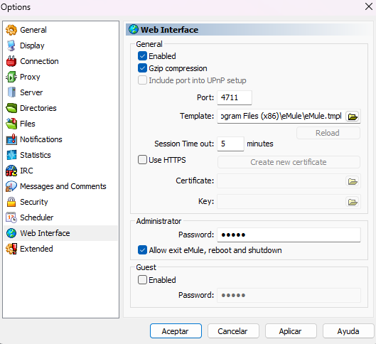
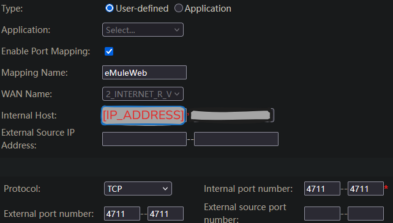

# eMuleModernWebInterface

Interfaz web moderna y adaptativa para el cliente P2P eMule. 


_¿Por qué usar estas plantillas?_

Me gusta eMule, pero su interfaz web es anticuada para dispositivos móviles, ofreciendo una UX (experiencia de usuario) pésima y dificultándome el control remoto de mi cliente eMule cuando quiero descargar archivos (películas, series, etc.) y estoy fuera de casa. 

Este repositorio contiene plantillas personalizadas (`.tmpl`) diseñadas para renovar visualmente la interfaz web de control remoto de eMule, ofreciendo una experiencia de usuario contemporánea, rápida y compatible con dispositivos móviles y tablets.

También se ha actualizado la interfaz para vista de escritorio.

**_¿No existía ya Mobile Mule?_**

Mobile Mule fue originalmente diseñada para teléfonos ya antiguos, capaces de ejecutar aplicaciones **Java (J2ME)**, pero su desarrollo se abandonó hace años. 

En 2026 se considera obsoleta; **es mucho más eficiente usar la Web Interface desde el navegador del móvil**. Es por eso que he decidido crear estas plantillas.

## Archivos y Propósito

### 📄 `eMulev50_0a.tmpl`
Es una plantilla basada en el diseño clásico **eMuleXP**.
- **Estilo**: Mantiene la estética tradicional y familiar de las versiones clásicas de eMule (v0.50a).
- **Propósito**: Sirve como opción de respaldo para asegurar compatibilidad total con instalaciones de eMule oficiales (las más antiguas).


### 📄 `eMulev0_70b.tmpl`
Es la **versión modernizada** diseñada para eMule v0.70b Community Edition.

- **Tecnologías**: Utiliza Tailwind CSS, Google Fonts (Inter y JetBrains Mono) y efectos de glassmorphism.
- **Características**: Totalmente responsive (adaptable a móviles y tablets), modo oscuro profundo, animaciones sutiles y una disposición de elementos optimizada para la gestión remota.
- **Propósito**: Proporcionar una interfaz de vanguardia para los usuarios de la versión más reciente de la comunidad.


## Configuración

1. Localiza la carpeta de instalación de tu eMule (normalmente en `C:\Program Files\eMule\config` o donde se guarden los archivos del servidor web).
2. Haz una copia de seguridad de tu archivo `eMule.tmpl` actual (por ejemplo, `eMule_backup.tmpl`).
3. Copia uno de los archivos de este repo (ej. `eMulev0_70b.tmpl`) a esa carpeta.
4. Renombra el archivo elegido a `eMule.tmpl`.
5. Habilita el servidor web en las Preferencias de eMule.
6. Establece la ruta de la plantilla en el _Template_ de la Web interface:

7. Aplica los cambios (_Aplicar_).

#### Recomendaciones
1. Establece contraseña para poder acceder a la interfaz web.
2. Habilita la _Gzip compression_ para mejorar el rendimiento.


### Cómo acceder a eMule desde red externa 

Si por ejemplo tu eMule está instalado en un PC con IP local `[IP_ADDRESS]` y el puerto del servidor web es el `4711`, y tratamos de conectarnos desde nuestro dispositivo móvil usando datos móviles (es decir, desde fuera de nuestra red local), no podremos conectarnos, ya que el router bloqueará la conexión. 

#### Port Forwarding
Para acceder a la interfaz web desde una red externa, debemos configurar el reenvío de puertos (port forwarding) en nuestro router. 

La configuración del reenvío de puertos varía según el modelo de router, pero en general, debemos seguir los siguientes pasos:

1. Acceder a la interfaz de administración de nuestro router. 
2. Buscar la sección de "Port Forwarding" o "Reenvío de puertos".
3. Crear una nueva regla de reenvío de puertos.  
4. Configurar la regla de la siguiente manera:


Una vez configurado lo anterior, abre el navegador de tu móvil/dispositivo externo y escribe en la barra de direcciones la dirección IP pública del PC donde tienes ejecutándose el eMule y el puerto configurado en el paso anterior:
```http
http://[PUBLIC_IP_ADDRESS]:4711
```
Ojo! 
> `[PUBLIC_IP_ADDRESS]` debe ser la IPv4 pública del PC que aloja el servicio eMule. Puedes consultarla en: https://whatismyipaddress.com/.    

> `4711` es el puerto configurado en el paso anterior. Puedes cambiarlo si lo deseas.

> Para que la Web Interface funcione, el ordenador debe estar encendido y el programa eMule debe estar ejecutándose.


##########################################################


# eMuleModernWebInterface (English)

Modern and responsive web interface for the eMule P2P client.

_Why use these templates?_

I like eMule, but its web interface is outdated for mobile devices, offering a poor UX (user experience) and making it difficult to remotely control my eMule client when I want to download files (movies, series, etc.) while I am away from home.

This repository contains custom templates (`.tmpl`) designed to visually renew the eMule remote control web interface, providing a contemporary, fast, and compatible experience for mobile devices and tablets.

The desktop view interface has also been updated.

**_Didn't Mobile Mule already exist?_**

Mobile Mule was originally designed for older phones capable of running Java (J2ME) applications, but its development was abandoned years ago.

In 2026, it is considered obsolete; it is much more efficient to use the Web Interface from a mobile browser. That is why I decided to create these templates.

Files and Purpose
📄 eMulev50_0a.tmpl

A template based on the classic eMuleXP design.

- Style: Maintains the traditional and familiar aesthetic of classic eMule versions (v0.50a).
- Purpose: Serves as a backup option to ensure full compatibility with official (older) eMule installations.

📄 eMulev0_70b.tmpl

The modernized version designed for eMule v0.70b Community Edition.

- Technologies: Uses Tailwind CSS, Google Fonts (Inter and JetBrains Mono), and glassmorphism effects.
- Features: Fully responsive (adapts to mobiles and tablets), deep dark mode, subtle animations, and an optimized element layout for remote management.
- Purpose: To provide a cutting-edge interface for users of the latest community version.

## Setup

1. Locate your eMule installation folder (usually in `C:\Program Files\eMule\config` or wherever the web server files are stored).
2. Create a backup of your current `eMule.tmpl` file (e.g., `eMule_backup.tmpl`).
3. Copy one of the files from this repo (e.g., `eMulev0_70b.tmpl`) into that folder.
4. Rename the chosen file to `eMule.tmpl`.
5. Enable the Web Server in eMule Preferences.
6. Set the template path in the Template section of the Web Interface:

7. Apply the changes.

Recommendations
- Set a password to access the web interface.
- Enable Gzip compression to improve performance.

## How to access eMule from an external network

If, for example, your eMule is installed on a PC with a local IP `[IP_ADDRESS]` and the web server port is `4711`, and we try to connect from our mobile device using mobile data (i.e., from outside our local network), we won't be able to connect because the router will block the connection.

### Port Forwarding

To access the web interface from an external network, we must configure port forwarding on our router.

Port forwarding configuration varies by router model, but in general, we must follow these steps:

1. Access your router's administration interface.
2. Look for the "Port Forwarding" or "Virtual Server" section.
3. Create a new port forwarding rule.
4. Configure the rule as follows:


Once configured, open the browser on your mobile/external device and type the public IP address of the PC where eMule is running and the port configured in the previous step into the address bar:

```http
http://[PUBLIC_IP_ADDRESS]:4711
```

Note!

> `[PUBLIC_IP_ADDRESS]` must be the public IPv4 of the PC hosting the eMule service. You can check it at: https://whatismyipaddress.com/.

> `4711` is the port configured in the previous step. You can change it if you wish.

> For the Web Interface to work, the computer must be turned on and the eMule program must be running.

------