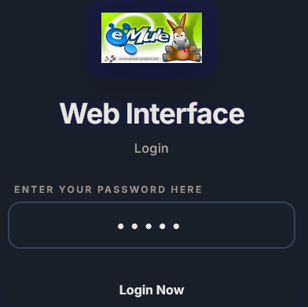
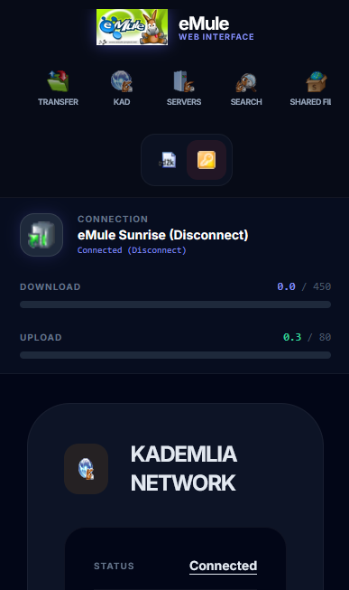
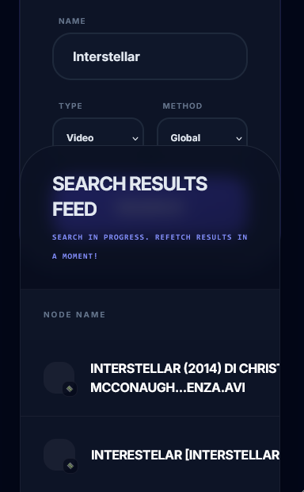
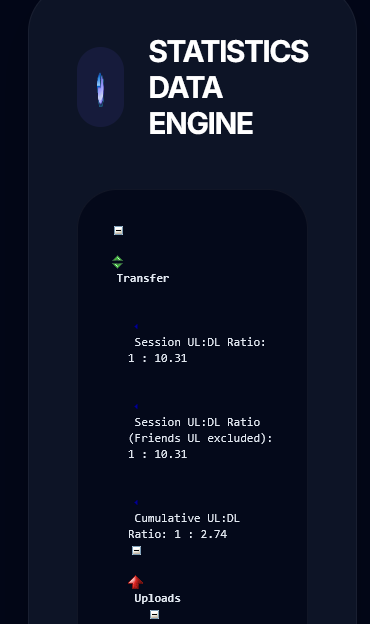
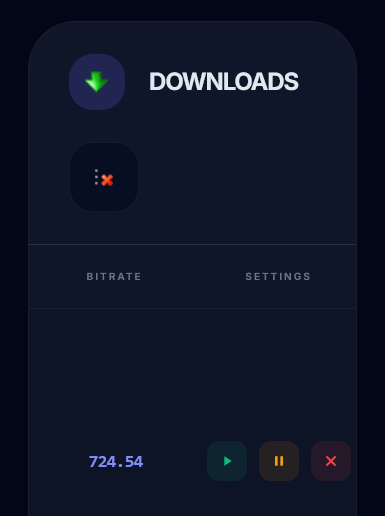

[](README.md)

# eMuleModernWebInterface

Modern and responsive web interface for the eMule P2P client.


_Why use these templates?_

I like eMule, but its web interface is outdated for mobile devices, offering a poor UX (user experience) and making it difficult to remotely control my eMule client when I want to download files (movies, series, etc.) while I am away from home.

This repository contains custom templates (`.tmpl`) designed to visually renew the eMule remote control web interface, providing a contemporary, fast, and compatible experience for mobile devices and tablets.

The desktop view interface has also been updated.

**_Didn't Mobile Mule already exist?_**

Mobile Mule was originally designed for older phones capable of running Java (J2ME) applications, but its development was abandoned years ago.

In 2026, it is considered obsolete; it is much more efficient to use the Web Interface from a mobile browser. That is why I decided to create these templates.

## File and Purpose

### 📄 `Modern_eMule.tmpl`

- **Technologies**: Uses Tailwind CSS, Google Fonts (Inter and JetBrains Mono), and glassmorphism effects.
- **Features**: Fully responsive (adapts to mobiles and tablets), deep dark mode, subtle animations, and an optimized element layout for remote management.
- **Purpose**: To provide a cutting-edge interface for users of the latest community version.











## Setup

1. Locate your eMule installation folder (usually in `C:\Program Files\eMule\config` or wherever the web server files are stored).
2. Create a backup of your current `eMule.tmpl` file (e.g., `eMule_backup.tmpl`).
3. Copy the file from this repo (e.g., `Modern_eMule.tmpl`) into that folder.
4. Rename the file to `eMule.tmpl`.
5. Enable the Web Server in eMule Preferences.
6. Set the template path in the Template section of the Web Interface:


7. Apply the changes.

### Recommendations
- Set a password to access the web interface.
- Enable Gzip compression to improve performance.

## How to access eMule from an external network

If, for example, your eMule is installed on a PC with a local IP `[IP_ADDRESS]` and the web server port is `4711`, and we try to connect from our mobile device using mobile data (i.e., from outside our local network), we won't be able to connect because the router will block the connection.

### Port Forwarding

To access the web interface from an external network, we must configure port forwarding on our router.

Port forwarding configuration varies by router model, but in general, we must follow these steps:

1. Access your router's administration interface.
2. Look for the "Port Forwarding" or "Virtual Server" section.
3. Create a new port forwarding rule.
4. Configure the rule as follows:


Once configured, open the browser on your mobile/external device and type the public IP address of the PC where eMule is running and the port configured in the previous step into the address bar:

```http
http://[PUBLIC_IP_ADDRESS]:4711
```

Note!

> `[PUBLIC_IP_ADDRESS]` must be the public IPv4 of the PC hosting the eMule service. You can check it at: https://whatismyipaddress.com/.

> `4711` is the port configured in the previous step. You can change it if you wish.

> For the Web Interface to work, the computer must be turned on and the eMule program must be running.
